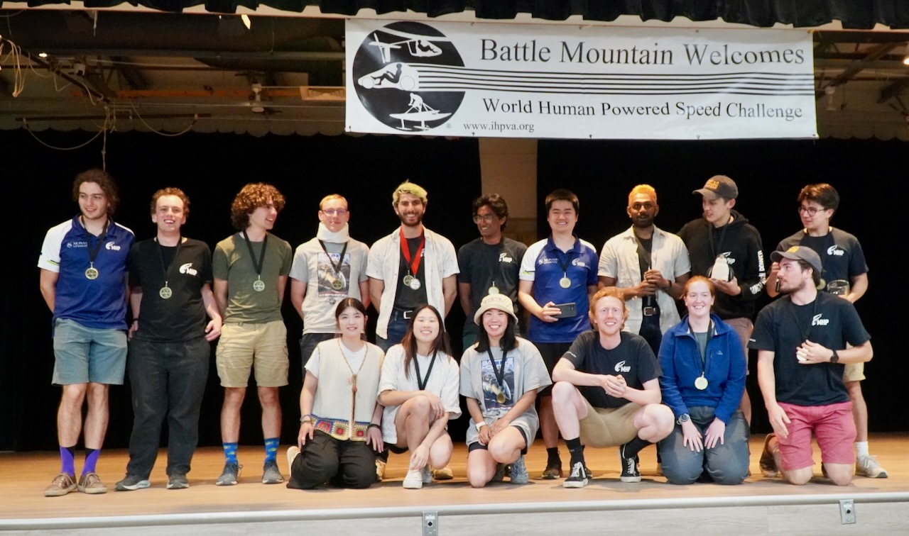
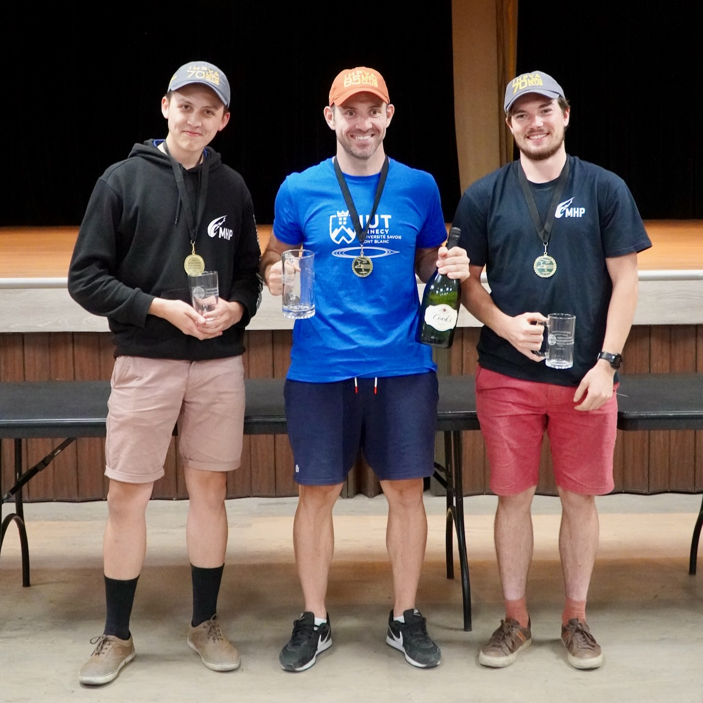
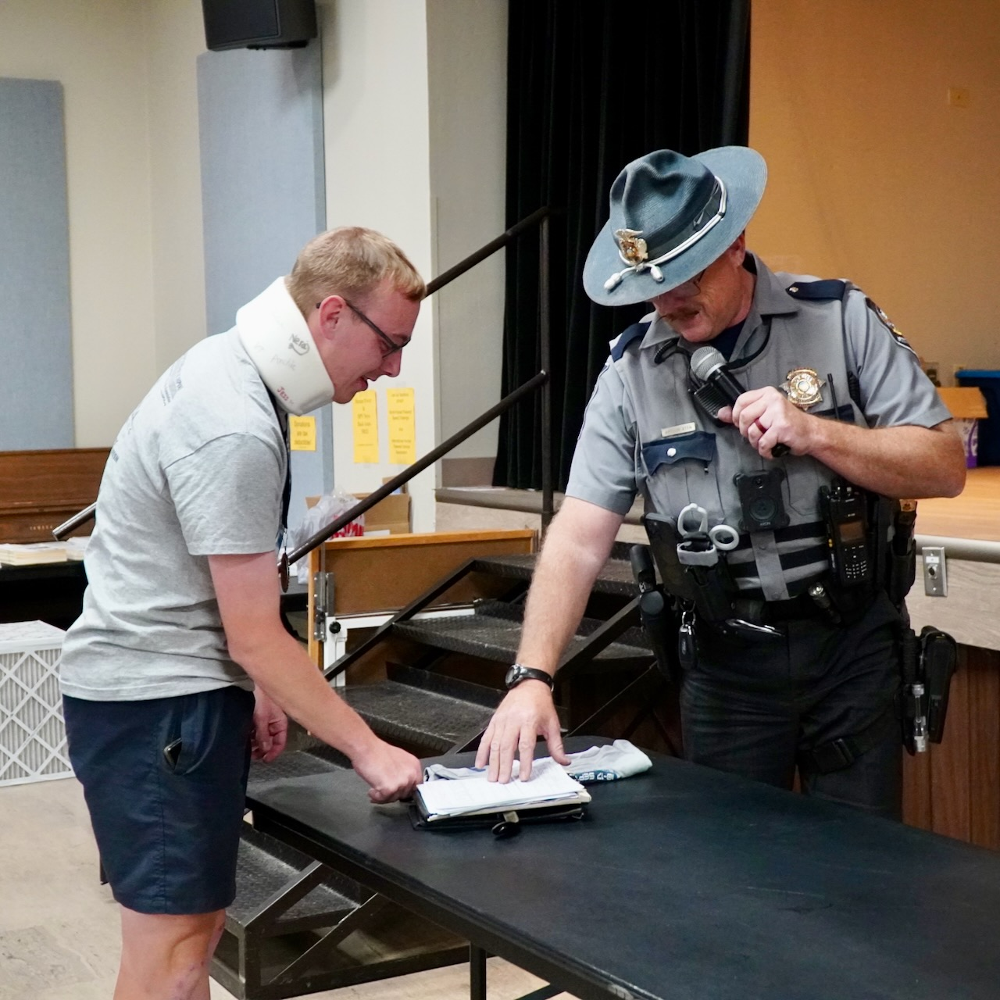
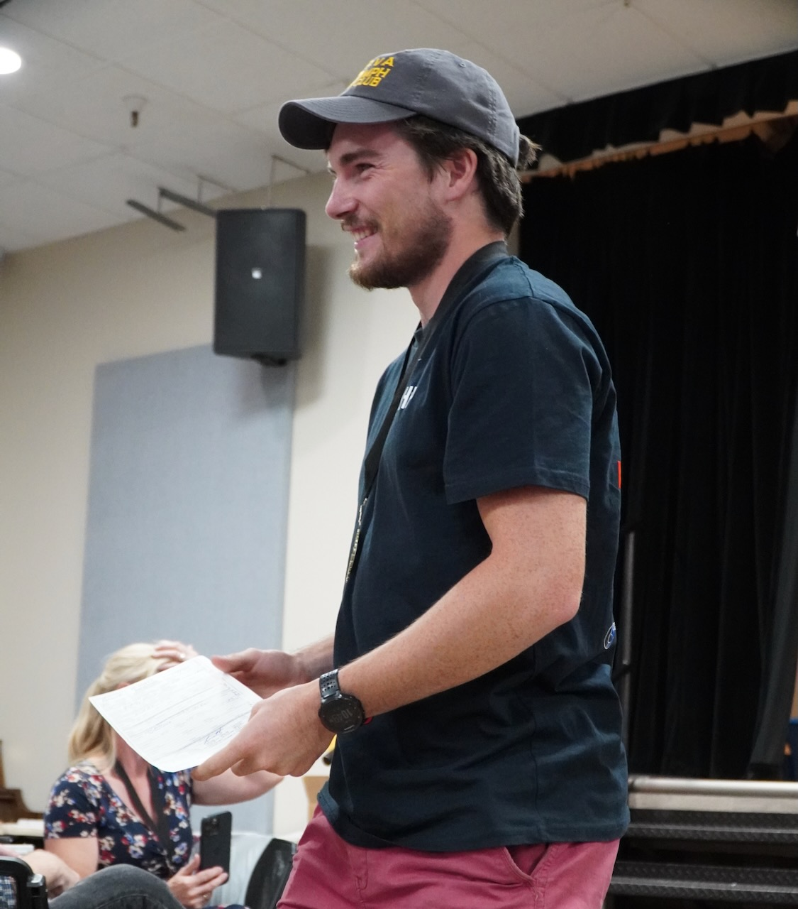
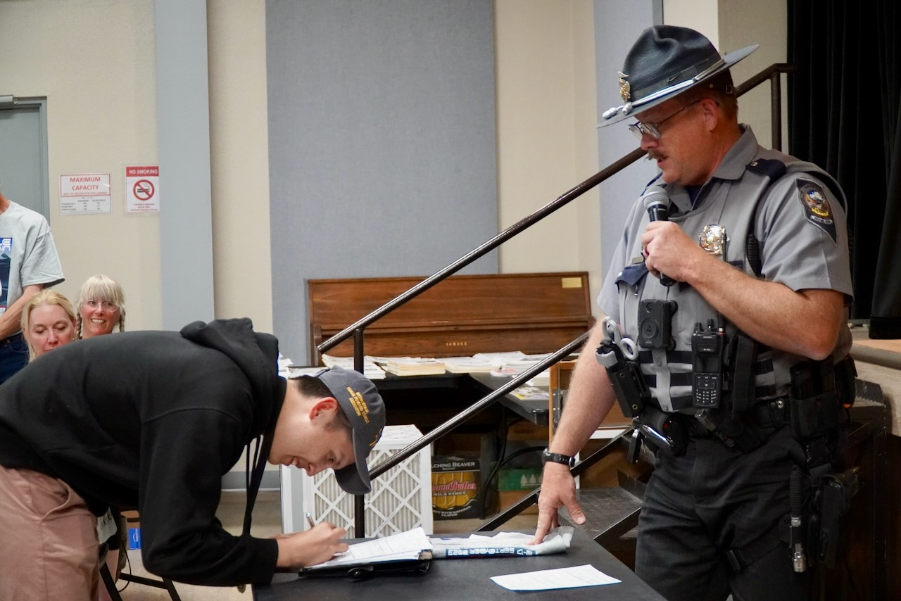

## Introduction

At the 2023 World Human Powered Speed Challenge, Monash Human Power broke the Australian men’s single track record. Our riders Alastair Haslam, Chris Hall, Kit Kirby and Oscar Varney raced in the challenge with "Bilby", our V3 bike. Both Kit Kirby and Alastair Haslam broke the Australian men’s single track record with wind legal runs.  Kit achieved a speed of 116.39 km/h and Alastair reached 116.05 km/h, making them the 39th and 42nd fastest riders in the history of this competition. Oscar and Chris each attained impressive speeds however, all their runs were in non-legal wind. Oscar and Chris accomplished speeds of 111.82 km/h and 110.76 km/h which placed them as the 56th and 61st fastest riders in history. Our bike "Bilby" has earned the title of the fastest single-track human-powered vehicle produced in Australia.

## Meet Monash Human Power (MHP)

We are a student-led university team that started off as a final year engineering project and evolved into the team as we know it today. Our vision is to become the most highly regarded human-powered vehicle team in Australia. Throughout the year, the team has been conducting extensive research and development to guide the design and manufacturing of future bike iterations. We have poured blood, sweat and tears into preparing for the WHPSC and are proud to announce that we have finally raced down State Route 305 at Battle Mountain, Nevada. We pride ourselves on promoting STEAM and Monash University to the wider community within the framework of human-powered vehicles and sustainable transport solutions. We provide Monash students valuable, real-world experience, preparing them for a career within the industry.

## What is 'The World Human Powered Speed Challenge' (WHPSC)?

The WHPSC is an annual challenge held in mid-September where cyclists from around the world gather to break current human-powered land speed records. The challenge allows cyclists to race down State Route 305, south of Battle Mountain, Nevada as it is one of the best roads in the world for human-powered vehicle records. The road is straight, smooth, at altitude and has an ideal road surface, allowing cyclists to reach top speeds. Riders have a 8 km acceleration zone to reach maximum speed and are then timed over a 200 m distance. 

We have been preparing for this competition since the very beginning - it has been the dream of 8 years to go to Battle Mountain. This marks a significant milestone: the first time we have ever raced at Battle Mountain. Our accomplishments are a testament to the dedication and hard work of every single person who has been part of MHP.

## Our Race Days

Upon arrival at Battle Mountain, we felt the buzz of excitement at the possibilities of the coming week and the speeds we could achieve. It was very exciting to see all the other teams ride and how they prepared for runs. Some of the event attendees believed our bike would go 70 mph or 113 km/h at most but we proved them wrong by having two of our riders go above 116 km/h and our other two go just under 113 km/h. 

The week was not without its challenges with some bad weather occurring on the third day of Battle Mountain, meaning that the heats were called off on that day. In addition, two of our riders experienced unlucky crashes. Alastair’s crash was due to a puncture in the front tire. This unfortunately produced some scratches on the fairing of “Bilby” but presented an opportunity for us to gain more data about our bike. More runs were conducted the next day to gain a comparison of the bike’s speed with and without scratches. We were fortunate that the Italian team, Policumbent, offered to give our team one of their Michelin blue tires which helped us replace the front wheel tire. Following this, our team spent a day returning the fairing to a finish as smooth as the original paint to maximise our chances at attaining higher speeds and we were able to resume racing down State Route 305. A few days later as Oscar was speeding down the road, he encountered a tube blow out, causing “Bilby” to roll over, crash and have its tail get wedged in the dirt. As per our safety protocols, Oscar was taken to the hospital for a check-up and was confirmed to be fine. The team repaired the bike with the tools on hand and further repairs will be conducted back in Melbourne.

## The Awards Ceremony

At the conclusion of the WHPSC, the event organisers held an award ceremony celebrating all our achievements. For the collegiate awards ranked in order of percentage of world record, we, representing Monash, came third.

For the individual awards for the men’s single track category, Kit Kirby (right) and Alastair Haslam (left) ranked 2nd and 3rd, respectively, following Francois Pervis (middle) who ranked 1st. Francois is one of the best cyclists in the world, a seven-time world champion. It was an honour to compete against him in the WHPSC.

Officer Arthur Aten showed up to hand out tickets for traffic offences, giving Oscar a ticket for failure to maintain lane and both Kit and Alastair tickets for going 2 mph and 3 km/h over the State Route 305 speed limit. 

## Future Goals

The WHPSC was an amazing experience where we had the opportunity to learn from other human powered vehicle teams and gained data on “Bilby”. We will be using the knowledge we’ve gained from this experience to develop V4, a new, better iteration of “Bilby”. In hopes of achieving even greater speeds, we plan on going back to Battle Mountain in 2025. Over the years, our team has  focused on developing two-wheeled bikes but we would like to expand our horizons and are currently building our first ever three-wheeled bike - a trike. This will open new avenues and allow us to enter local human-powered vehicle (HPV) competitions. Our team will continue to work on outreach with both primary and secondary schools, promoting STEAM and spreading interest in HPVs.

## Conclusion

Our journey to Battle Mountain has been a long one filled with the hard work and dedication of all our members here at MHP. We’ve learned so much from the challenge and we’ll be using the knowledge we’ve gained to improve V3 and inform our design decisions for V4, our next bike. The accomplishments we’ve reached have been significant and are a remarkable milestone in our history. Our team would like to thank the WHPSC organisers, Alice and Alan Krause, all the volunteers, as well as Monash University and the Engineering faculty for the support they have provided us.

To stay updated with our future projects and achievements, follow our social media linked below:

* [Facebook](https://www.facebook.com/MonashHumanPower/)
* [Instagram](https://www.instagram.com/monashhumanpower/)
* [LinkedIn](https://www.linkedin.com/company/monashhpt/)
* [GitHub](https://github.com/monash-human-power)
* [TikTok](https://www.tiktok.com/@monashhumanpower)