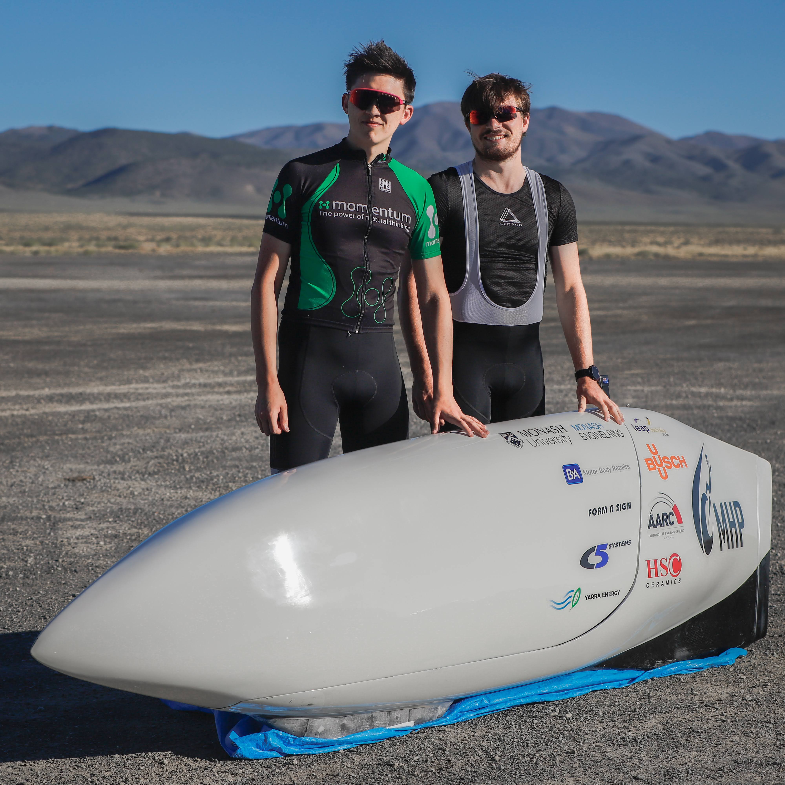
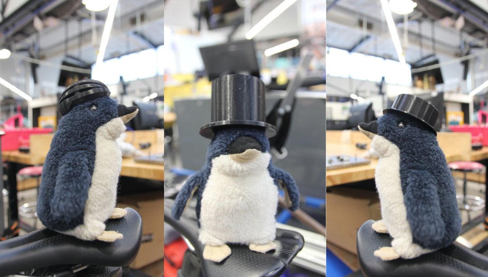
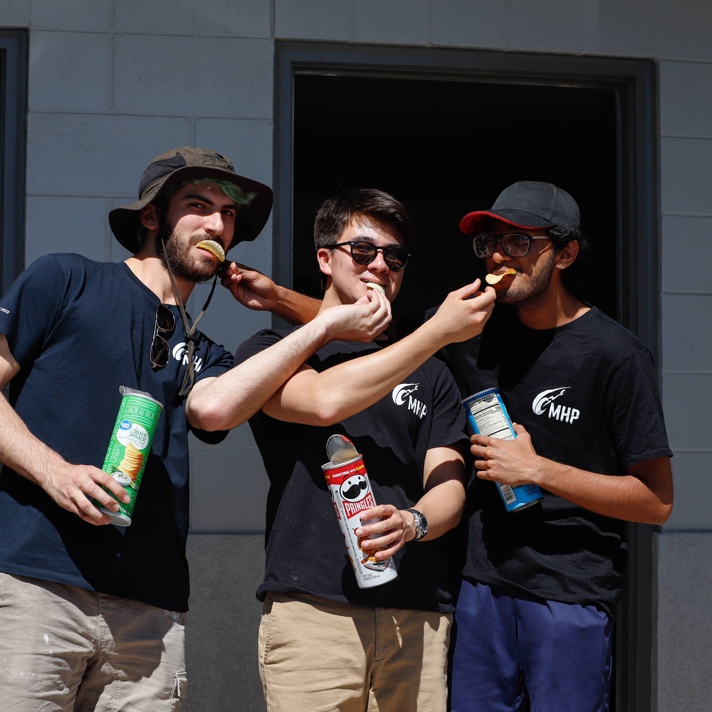
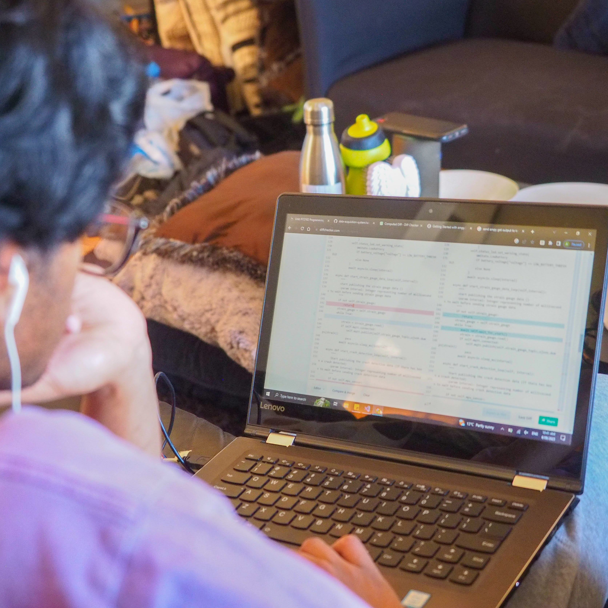
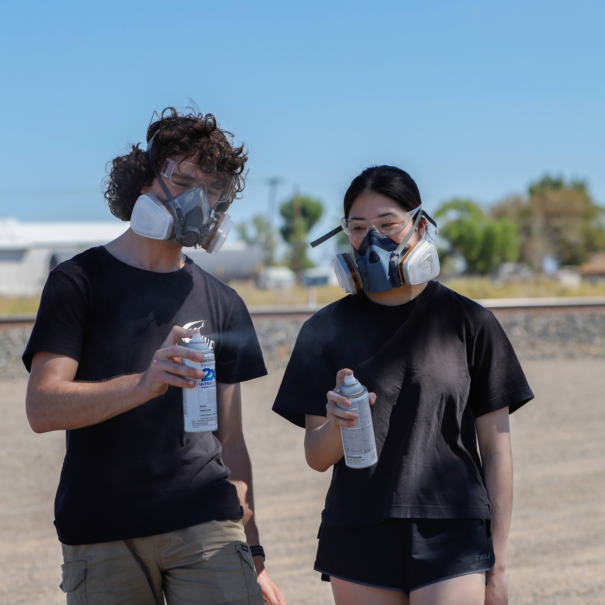
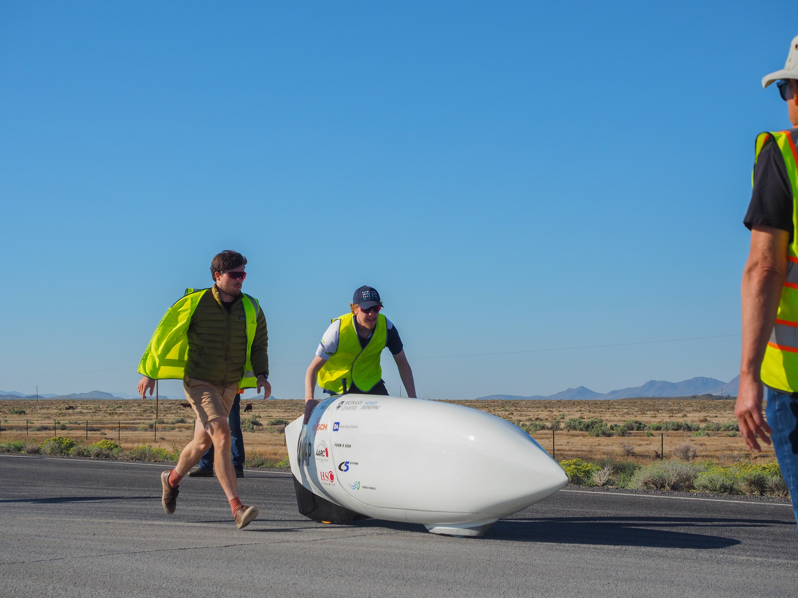
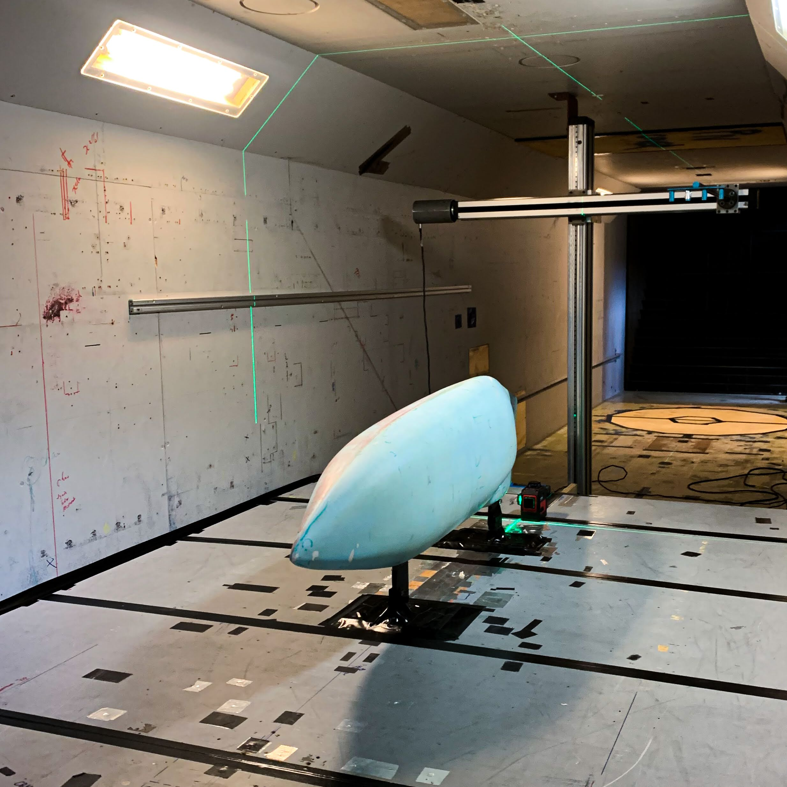
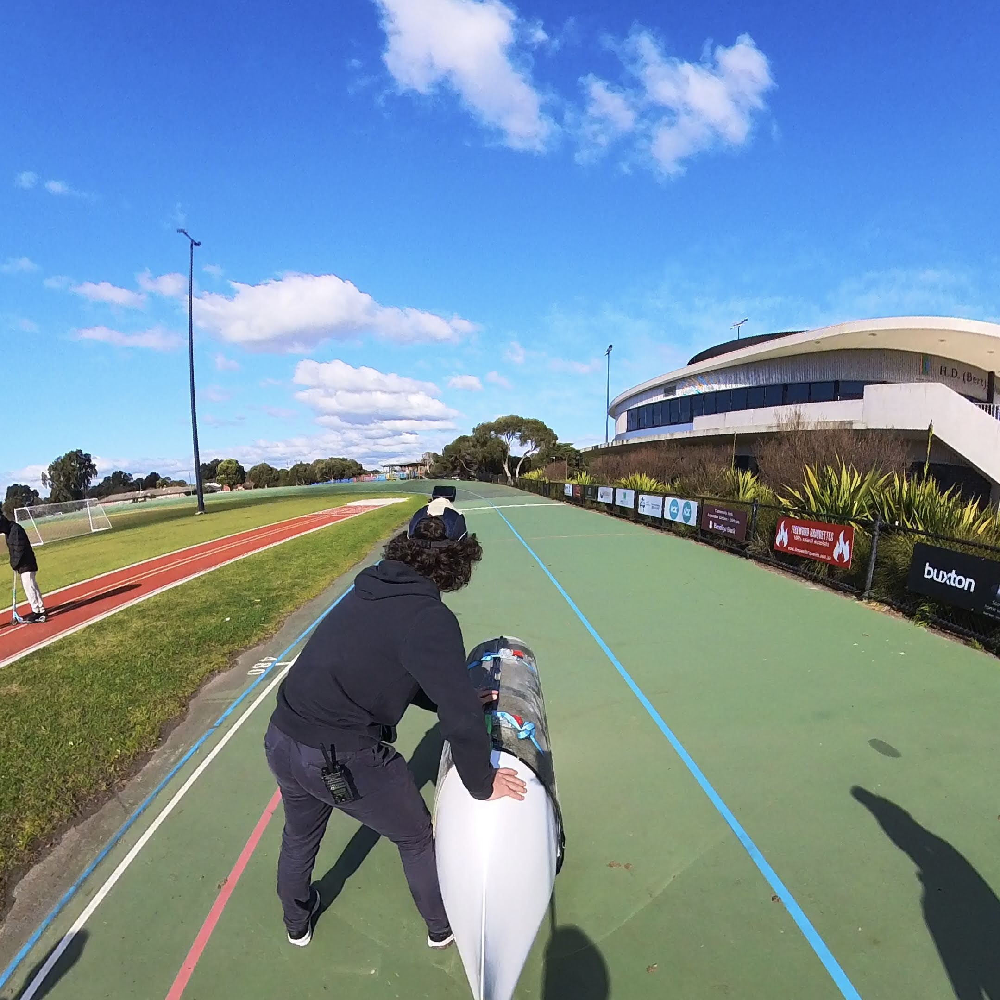

### **1. We broke the Australian men’s single track record at the World Human Powered Speed Challenge (WHPSC)**

Prepare to be blown away by the speed demons of our team! In a thrilling tale of determination and speed, we ventured across continents from Melbourne, Victoria to Battle Mountain, Nevada to make our debut at the World Human Powered Speed Challenge (WHPSC). Our fearless riders, Kit Kirby and Alastair Haslam, etched their names into history by shattering the Australian men's single track record. The adrenaline-pumping event at Battle Mountain witnessed our cyclists achieving amazing speeds of 116.39 km/h and 116.05 km/h, securing their places as record-breakers. The journey was no easy feat, with years of hard work culminating in this moment of triumph.

### 2. Our mascot is … drumroll … Percy the Penguin 🐧! 

Meet Percy the Penguin, our superstar! Eons ago, we navigated the mascot wilderness until fate brought us Percy. Discovered in the workshop (or perhaps brought in by one of our team members - we can’t quite recall), Percy emerged as the unlikely hero, and things have never been the same. He’s not only stolen our hearts but also earned the title of our beloved mascot. During Covid, misfortune befell us and we lost him. We thought all hope was lost, but lucky for us, he reappeared when we least expected it - during our move from our old workshop to Makerspace. Percy isn't your average penguin, he loves fashion and keeps up with the trends with not one, not two, but three 3D printed hats! Rumour has it that this dapper bird will have more hats in other colours soon (look forward to it). Check out the pictures of his hat collection! 

### 3. We originated as a final year student project

Embark on a journey back to our roots as we unveil the humble beginnings of MHP. Believe it or not, this team didn't start as a grand vision but emerged from the grounds of a final year engineering student project in 2014. Picture a group of our first few members channelling their creativity and passion into a project that would later blossom into the incredible team as we know it today!

### 4. We build human powered vehicles (HPVs) but we have an Electrical Subteam?

While we're renowned for building fast bikes, there is one subteam that takes our game to the next level. The Electrical Subteam dives deep into the realms of both hardware and software wizardry, designing a cutting-edge camera and data acquisition system that becomes the eyes and ears of our riders. With no windows to rely on and being completely enclosed in the fairing, the rider depends on this system to navigate their surroundings in real-time, ensuring safety and optimising performance. Armed with Raspberry Pis, microcontrollers, and a network of sensors, our electrical team create custom software that not only records data from field testing but sets the stage for post-race analyses, delving into the intricacies of our bike's performance.

### 5. We bought a second-hand trike and are currently in the midst of modifying it so we can participate in Victorian HPV races

Hold onto your helmets because we’ve thrown tradition for a loop and ventured into the realm of trikes! We’ve acquired a second-hand trike and are now delving into the world of modifications. Known for our legacy of building bikes, this shift marks a new chapter in our story. This is a testament to our team’s adaptability and eagerness to explore uncharted territories. So, get ready for our debut at the Victorian HPV Grand Prix Series!

### 6. Our riders reach highway level speeds on about half the power of a toaster

Yes, you read that right - while most of us are content with toasting our morning bread, our riders are zipping down the road at highway level speeds. It’s not just the pedal power, but the sleek design, aerodynamics, and engineering ingenuity that propels our bikes to highway-worthy speeds. So, the next time you reach for your toaster, think about our riders breaking speed barriers with just a fraction of that energy!

### 7. Despite being a "bike" team we have more scooters than bikes

If you’re ever near our workshop, chances are, you’ll witness our team members racing past you on scooters. We’re not just about the bikes, we’ve embraced the joy of scooting and spontaneity in our team. So much so that the number of scooters we have outweighs our bikes. So, if you ever walk past Monash Makerspace, watch out for the scooter brigade!

[Click here to see our scooter brigade whizzing past makerspace!](https://www.instagram.com/reel/C0s7FmXhyoD/?utm_source=ig_web_button_share_sheet&igsh=MzRlODBiNWFlZA==)

### 8. We were the last team of people to use the Monash wind tunnel before it was shut down 😱

We hold the prestigious title of being the last to feel the winds in the Monash wind tunnel before it shut down. But why, you ask, did this wind tunnel meet its end? Unfortunately, it was due to the car manufacturers leaving Australia after the onslaught of the COVID-19 pandemic. The once-humming wind tunnel fell silent not due to obsolescence, but the harsh reality of insufficient funds. With the automotive industry's departure, there simply weren't enough cars to test, leading to the bittersweet closure of the Monash wind tunnel. However, as luck has it, we have the fortune of running tests in Monash’s smaller wind tunnels which (fun fact) operate on less power!

### 9. Our bike (V3) is designed around crashing at speeds of 110 km/h or more 🫣

Now, before the gasps and concerns set in, no we don't crash our bikes on purpose. We just do extensive analysis and testing throughout our design processes to ensure that our riders will always be protected and leave crashes unscathed - safety is our top priority!

### Conclusion

Did you learn something new? If you’d like to keep up with more facts about us, follow us on our socials (linked below)!

* [Facebook](https://www.facebook.com/MonashHumanPower/)
* [Instagram](https://www.instagram.com/monashhumanpower/)
* [LinkedIn](https://www.linkedin.com/company/monashhpt/)
* [GitHub](https://github.com/monash-human-power)
* [TikTok](https://www.tiktok.com/@monashhumanpower)