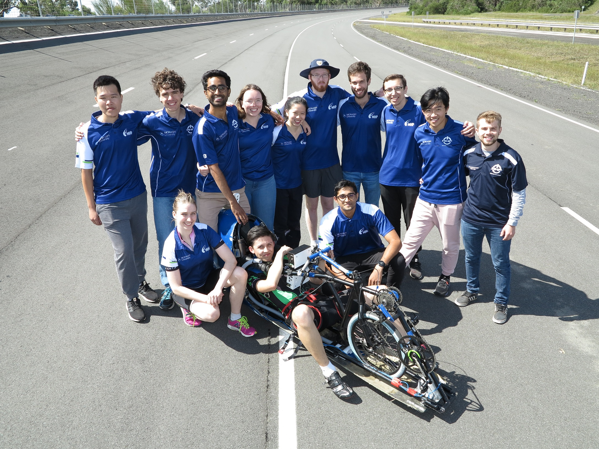

_We're off to the races now!_

**and we're going _HARD_ on it!**

## WTF is this!?

Some random paragraph from [Wikipedia](https://en.wikipedia.org/wiki/Human-powered_transport):

> Human-powered transport is the transport of person(s) and/or goods using human muscle power. Unlike animal-powered transport, human-powered transport has existed since time immemorial in the form of walking, running and swimming. Modern technology has allowed machines to enhance human-power.

## Some things I like about MHP

- it's fun
- it's creative
- the people are nice

## A document editor that can't easily insert code doesn't earn my respect.

You can put code `inline with the paragraph`.

Or you can put a code block with syntax highlighting and all:

```c
#include <stdio.h>

int main() {
    printf("Hello World\n");
    return 0;
}
```

## You can include images inline, like this



## Some tables

| Heading 1 | Heading 2 |
| --------- | --------- |
| Body 1    | Body 2    |
| Body 3    | Body 4    |

# Heading 1 (try to not use this)

## Heading 2

### Heading 3

#### Heading 4

##### Heading 5

###### Heading 6
